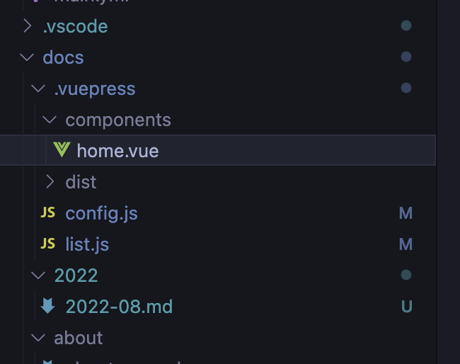

# 2022년 8월 TIL

## 2022.08.28

### 운영체제

::: tip Memo  
KOCW 통해 이화여대 반효경 교수님 운영체제 강의 수강 (2014년 버전)  
:::

1. 운영체제란?

- 컴퓨터 하드웨어 바로 위에 설치되는 소프트웨어. 사용자가 실 사용하는 모든 소프트웨어와 하드웨어를 연결하는 소프트웨어 계층이라고 할 수 있다.
- 하드웨어를 직접 컨트롤하는 복잡한 부분을 운영체제가 대행해준다. 그를 통해 컴퓨터를 조금 더 편하게 사용할 수 있는 환경을 제공.

2. 운영체제의 기능(=목표)는?

- 크게 나누면 다음과 같은 두가지 역할을 한다.
  - 하드웨어와 사용자를 어떻게 연결할 것인가?
  - 하드웨어와 기타 소프트웨어를 어떻게 연결해줄 것인가?
- 컴퓨터 시스템의 **자원을 효울적으로 관리한다.** (중요‼️‼️‼️)
  - 이 떄, 이 자원에는 컴퓨터의 프로세서(=cpu, 즉 컴퓨터의 연산 및 제어장치), 기억장치(=메모리), 입출력 장치 등이 포함된다.
  - 하드웨어 영역의 컴퓨터 시스템 리소스를 효율적으로 관리하는 역할을 하는 소프트웨어라고 생각하면 됨. 단, 이 소프트웨어는 동시에 다른 소프트웨어들이 실행되는 바탕의 역할을 한다.

3. **운영체제의 가장 중요한 목표는 컴퓨터 시스템의 자원을 효율적으로 관리하는 것이다.**

- 이 때 효율성과 형평성 등을 고려하야야 한다.

## 2022.08.22

### Observable

Observable이란?

- RxJS의 정의에 따르면, 자바스크립트의 비동기 환경에서 여러 데이터를 다루는 도구이다. 이벤트 스트림을 관리할 수 있으며 중간에 취소가 가능함.
- 이 `취소 가능하다`는 부분이 중요한 게, JS에서 비동기를 처리할 때 가장 많이 사용하는 Promise 객체의 최대 단점이 중간에 취소 불가능하다는 점이기 때문이다.
- Observable을 이용하면 비동기 요청의 흐름을 쉽게 확인할 수 있고, 요청 중간에 취소를 비롯한 관리가 가능함.

```js
// 예시 코드
import { Observable } from "rxjs";

const observable = new Observable((subscriber) => {
  subscriber.next(1);
  subscriber.next(2);
  subscriber.next(3);
  setTimeout(() => {
    subscriber.next(4);
    subscriber.complete();
  }, 1000);
});
```

::: tip ref

[비동기를 우아하게 처리하기 위한 Observable 발표자료 - 나석주](https://slides.com/seokjume/observable#/1-title)  
[RxJS 간단정리](https://pks2974.medium.com/rxjs-%EA%B0%84%EB%8B%A8%EC%A0%95%EB%A6%AC-41f67c37e028)  
[RxJS - observable](https://rxjs.dev/guide/observable)

:::

### useRef typescript 지정

useRef를 이용해 특정 요소의 click 이벤트를 타 요소와 연결해주고 싶은 경우, 제네릭을 이용해 타입을 지정해주면 된다. focus를 사용할 때에도 유사한 방식으로 활용 가능.

```js
const inputRef = useRef < HTMLInputElement > null;

const handleFileBtn = () => {
  if (inputRef.current) {
    inputRef.current.click();
  }
};
```

```js
// props에 대한 types interface 파일
export interface IReviewsWriteUIProps {
  inputRef: RefObject<HTMLInputElement>;
}
```

## 2022.08.20

### 해시테이블

1. 해시테이블이란?
   - 해시함수를 사용하여 변환한 값을 index로 삼아 key: value 형식으로 데이터를 저장하는 자료구조. 탐색, 삽입, 삭제 속도가 굉장히 빠르다.
2. 데이터의 key에 해당하는 데이터를 해싱(Hashing)을 거쳐 index로 변환한다. 그리고 해당 index를 key 삼아 value를 테이블에 저장한다.
3. 해싱이란?
   - key에 해당하는 데이터를 해시함수(Hash Function)를 사용하여 고정된 길이의 값으로 변환하는 작업. 해시테이블에서는 일반적으로 불특정한 문자열으로 변환하는 해시함수를 사용하지 않고 정수값으로 변환하는 해시 알고리즘을 사용한다.
4. 충돌 발생 가능성 있음. 해시 값은 고유해야 하는데, 서로 다른 데이터가 동일한 해시 값을 가지게 됨으로 인해 테이블 내의 데이터 충돌이 발생하는 상황을 Collision(충돌)이라고 한다. 알고리즘이 아무리 정교해도 모든 입력 값에 대해 고유한 해시 값을 만들수는 없으니 해시 함수의 충돌은 불가피하다고 볼 수 있음.
   - 충돌 해결 방법에는 Linked list를 이용하는 방식, 개방 주소법을 이용하는 방식, 이중 해싱을 이용하는 방식, 해시 함수의 알고리즘을 개선하는 방식 등등이 있다.

::: tip ref

- [해쉬테이블이란?](https://baeharam.netlify.app/posts/data%20structure/hash-table)
- [자료구조 Hash Table](https://luyin.tistory.com/191)
  :::

### vuepress로 블로그 만들기

티스토리 블로그에 계속 TIL을 쓰는게 번거롭고 비효율적이라고 생각하던 차, [진유림님의 TIL](http://milooy.github.io/TIL/)을 보고 TIL만 따로 기록하는 공간을 만들어야겠다는 생각이 들었다.

::: tip 티스토리에 TIL을 함께 작성했을 때의 문제점

- 티스토리에 TIL을 같이 쓰니까 TIL도 어느정도 글의 완결성이 있어야 한다는 압박감이 든다. 그 떄문에 잘 안쓰게 됨. 쓰는데에 생각보다 에너지가 많이 들어가는데, 이렇게 작성하기 힘들어서야 매일 쓸 수 있을리 없다. 😞
- 티스토리가 지저분해보인다. 제목이 있는 글과 제목 없이 날짜만 적혀있는 TIL이 왕창 엉켜서 난리 난리가..
- 티스토리는 '일지'를 작성하기 좋은 포맷은 아니다. 그렇다고 내가 마음에 드는 형태로 수정하자니 품이 너무 많이 들 것 같음.
  :::

그런 이유로 TIL용 vuepress 페이지를 만들고, github page를 이용해 배포했다.

- vuepress란? vue를 베이스로 하는 정적 페이지 생성기. 나는 `React에 Gatsby가 있다면 vue에는 vuepress가 있다!` 정도로 이해했다.
- 왜 Gatsby가 아니라 vuepress를 사용했는가? 둘 다 프로젝트를 생성해봤는데, 간편한 레이아웃으로 내가 원하는대로 TIL 로그를 기록하기에 더 적합해보였음. vue 공식 문서도 vuepress로 되어있다고 한다.
- [vuepress 공식문서](https://vuepress.vuejs.org/)
- vuepress 프로젝트 생성하고 기본 설정 및 메인페이지 작성 완료. 나의 첫 .vue 파일이다..  
  

### github page deploy를 위한 커맨드 생성 (with git subtree)

공식 문서에서 지시하는 대로 github page 배포까지 하는건 어렵지 않았다. build하면 생성되는 dist 경로에 들어가 해당 내용을 내가 원하는 branch에 push하고, 해당 branch를 배포하도록 github setting에서 설정해주면 된다.

문제는 그 다음이다.  
매일 TIL을 쓸 때마다 build하고, vuepress 프로젝트를 커밋하고, build한 경로로 이동해서 빌드된 정적파일을 배포된 브랜치에 커밋하고. 이 번거로운 작업을 매일매일 할 수는 없었다.
그래서 위에도 링크했던 [진유림님의 TIL github](https://github.com/milooy/TIL)와 [임동진님의 vuepress 가이드](https://limdongjin.github.io/vuejs/vuepress/), 그리고 여러 현자들의 도움 (예를들면 [이런](https://www.three-snakes.com/git/git-subtree))으로 git subtree 기능을 활용해 배포 단계를 아주 약간 더 단순하게 만들었다.  
이제 yarn deploy를 입력하면 다음과 같은 명령어가 실행된다.

```
git push origin main && git subtree push --prefix=docs/.vuepress/dist origin gh-pages
```

이걸 하기 위해 SSH Key도 만들어서 github 인증을 다시 해줬고, subtree prefix도 만들어줬다.  
이제는 TIL을 다 작성한 다음 다음과 같은 명령어만 입력하면 된다.

```
yarn build
git add .
git commit -m "커밋메시지"
yarn deploy
```

### github action을 이용한 자동배포는 실패

사실 github action을 이용해 main 레포에 push가 들어가면 빌드 && 배포 작업도 같이 진행되도록 만들고 싶었는데, 왜인지 모르겠지만 실패했다. 환경변수에 accessToken도 제대로 넣어줬는데..  
다음에 마저 도전해봐야겠다.

::: tip 참고했던 내용들.

- [진유림님 블로그](https://milooy.wordpress.com/2020/07/28/github-actions%eb%a1%9c-vuepress-%eb%b0%b0%ed%8f%ac%ed%95%98%ea%b8%b0/)
- [Vuepress로 TIL 블로그 만들기](https://velog.io/@mulgyeol/GitHub-Actions%EB%A1%9C-Vuepress-%EB%B0%B0%ED%8F%AC%ED%95%98%EA%B8%B0)
- [Vuepress 공식 문서 deploy 항목](https://vuepress.vuejs.org/guide/deploy.html#github-pages)  
  :::
