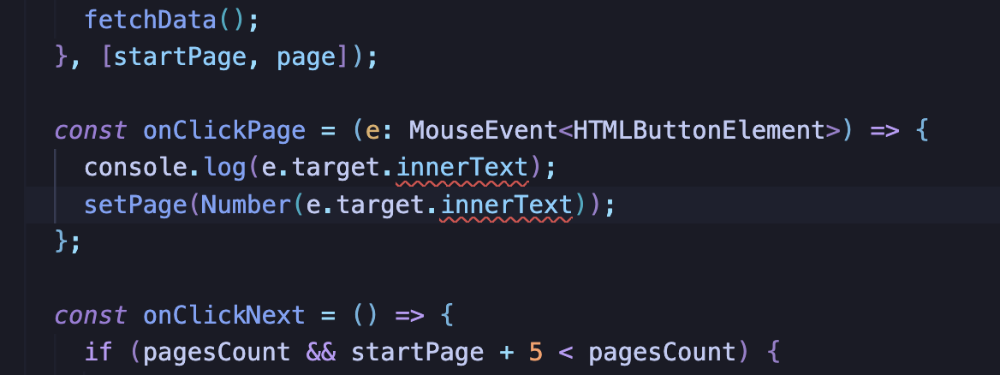

# 2022년 10월 TIL

## 2022.10.14

### CSS 전역 스타일을 관리하는 세가지 방법

> 기준은 Next.js 혹은 React와 Emotion을 함께 사용하는 경우

1. **Emotion의 ThemeProvider를 사용하는 경우**
   ThemeProvider는 일종의 context-api이다. ThemeProvider로 감싼 컴포넌트 전체 영역에 props의 형태로 Theme에 지정된 속성을 내려보낸다. 단,theme이 변경되었을 때 감싸고 있는 모든 컴포넌트를 리렌더링 한다는 문제가 있음.
2. **JavaScript 상수로 관리하는 경우**
   JS 상수에 전역 스타일 속성을 입력하고 export해서 사용할 수 있다. CSS-in-JS이기에 가능한 방법. (매우 편하다.)
3. **CSS Variable을 사용한다.**
   CSS에서 제공하는 variable을 사용한다. css만을 이용하는 방법이기 때문에 렌더링 효율이 좋다. 세가지 방법 중 이 방법만은 꼭 CSS-in-JS가 아니라 바닐라 CSS에서도 사용할 수 있다.

## 2022.10.11

### async/await와 마이크로큐(=마이크로태스크)

근데 오늘은 정!말! 기록할 시간이 없다!  
간단한 로그 조차도!
일단 팀원들과 논의하며 메모한 내용 사진 찍어서 올려놓는다.


## 2022.10.10

### e.target.innerText 타입스크립트



페이지네이션을 구현하려고 이벤트 핸들러가 실행되는 Button 요소의 innerText를 가져왔는데, 어이없게도 타입스크립트가 EventTarget 안에 innerText가 없다는 에러를 뱉었다.

```
'EventTarget' 형식에 'innerText' 속성이 없습니다.ts(2339)
Property 'innerText' does not exist on type 'EventTarget'.
```

ButtonElement에 innerText 어트리뷰트가 없는건가? 싶어서 코드를 타고 들어가봤다. 그런데 심지어는 HTMLButtonElement의 확장 이전 모체인 HTMLElement에도 멀쩡하게 보이는 innerText..


타입스크립트 자체 이슈인가 싶음. 아무리 생각해도 에러가 뜨는 원인을 모르겠다.  
일단 as를 이용해 HTMLButtonElement를 e.target에 강제 지정해주어 문제는 해결했다.


```ts
const onClickPage = (e: MouseEvent<HTMLButtonElement>) => {
  const button = e.target as HTMLButtonElement;
  setPage(Number(button.innerText));
};
```

::: tip 참고  
[스택오버플로우 유사 이슈 질문](https://stackoverflow.com/questions/54886637/error-property-innertext-does-not-exist-on-type-eventtarget)  
:::

## 2022.10.09

### 고가용성 (High Availability, HA)

동생이랑 저녁 먹으며 떠들다가 처음 접한 개념.  
고가용성이란 **사용자의 가용성을 높이는 것** , 즉 **서버에 장애가 나더라도 사용자가 항상 서비스를 이용할 수 있게 하는 것** 이다. 아무리 서버 관리를 잘 안해도 언젠가는 장애가 발생할 수 밖에 없는데, 고가용성 솔루션 등을 이용해 이러한 장애 상황에 대비해두면 사용자는 장애 상황과 무관하게 가용성이 유지되는 서비스를 사용할 수 있다.  
**사용자가 실제 사용하는 Primitive와 Secondary 서버를 동시에 운용** 한다. Primitive DB에 저장되는 데이터는 Secondary 서버에도 동일하게 백업되도록 하고, 만약 Primitive 서버에 장애가 생기면 **Secondary 서버와 미리 백업해두었던 DB를 Primitive로 승격** 시켜 서비스와 바로 연결되도록 한다. 차후 Primitive 서버가 복구되면 Secondary 포지션으로 올려놓고, 환경 설정에 따라 Primitive로 임시 승격되었던 Secondary를 탈락시킨 뒤 다시 Primitive로 끌어올리면 된다.

- 이상은 동생 회사에서 채택하고 있는 고가용성 설정에 대한 대략적 설명이고, 서비스 환경이나 사용하는 솔루션에 따라 방법은 다양하게 채택할 수 있는 모양
- 게임, 미디어 솔루션 등 서버의 운용이 잠시라도 끊기면 막대한 장애가 발생하는 종류의 서비스에서는 필수적으로 운용하는 개념(인 듯 하다.)

## 2022.10.07

### Next/link의 prefetch

Next.js에서 router를 이용하지 않고 link를 사용해서 라우팅을 하는 경우 어떠한 장점이 있을까?

1. 라우팅의 트리거가 되는 요소를 a태그로 렌더링할 수 있음. 웹 접근성 측면에서 효율적이고, SEO에 유리하다.
2. prefetch가 이루어진다.
   - 백그라운드에서 페이지를 미리 가져온다. 뷰포트 내에 있는 모든 Link가 미리 로드됨.
   - 정적 생성된 페이지의 경우, 빠른 페이지 전환을 위해 데이터가 포함된 JSON 파일도 미리 로드한다.  
     (ssg build, 즉 `next build && next export` 시)
   - `<Link/>` 를 사용하는 경우 prefetch가 이루어지는 것이 기본값이다. `prefetch={false}`를 props로 보내 막을 수 있다.

참고: [Next.js 공식문서 - next/link](https://nextjs.org/docs/api-reference/next/link)

### 데이터 통신시 useEffect를 사용하는 경우의 문제점

[참고 Article](https://articles.wesionary.team/why-useeffect-is-a-bad-place-to-make-api-calls-98a606735c1c)

### input 태그의 valueAsNumber

html의 `<input type="number"/>` 태그에 입력된 내용을 이벤트 핸들러 내에서 `event.target.value`를 이용해 받아오면 string으로 읽어온다.  
`value` 대신 `valueAsNumber`를 이용하면 string이 아닌 number 타입으로 데이터를 받아올 수 있다. 이렇게 하면 데이터 타입을 함수 내에서 number로 변환하는 수고를 줄일 수 있다.

### 추상화, 은닉화

소프트웨어 개발에 있어서 추상화, 은닉화란 대체 무엇인가?

📌 **추상화**

- 단어의 뜻을 직역하면 '추상적인 것으로 만들거나 되거나 하는 것'
- 컴퓨터 과학에서 추상화(abstraction)는 복잡한 자료, 모듈, 시스템 등으로부터 핵심적인 개념 또는 기능을 간추려 내는 것을 말한다.
- 복잡함 속에서 필요한 관점만을 추출하는 행위를 추상화라고 하며, 해당 모듈을 사용하는 사람들의 실질 관심사만을 반영하는 방식으로 실현 가능하다.
- 일종의 '테마'로, 특정한 기법이나 문법을 익힌다고 되는 것이 아니라 사고 능력이 필요한 일이다.

📌 **은닉화**

- 은닉화란 private 등을 이용하여 주요 사항이 드러나지 않게 감추는 것이다.
- javascript는 private을 지원하지 않는다. (유사한 구현체는 제공하지만, 엄밀하게 protected 히지는 않다.)
- typescript는 private를 지원한다.

연관있는 개념 : 캡슐화, 상속성, 다형성 등

## 2022.10.04

### 프로그래밍에 있어서 응집도란?

`좋은 코드란 무엇인가?` 혹은 `좋은 프로덕트 설계는 무엇인가?` 라는 키워드로 쓴 글을 보면 자주 나오는 문장. **낮은 결합도(Coupling)와 높은 응집도(Cohesion)** 를 갖도록 설계된 프로덕트가 좋은 프로덕트라는 것.  
결합도와 응집도라는 개념은 모듈의 독립성과 관련되어있다. 소프트웨어를 모듈화할 때, 독립성이 높아서 수정이나 재사용이 용이한 모듈이 좋은 모듈이라고 이야기하는데, 결합도와 응집도는 모듈의 독립성을 측정하는 지표이다.

📌 **결합도란?**

- 서로 다른 모듈 간에 상호 의존하는 정도, 혹은 서로간에 연관된 관계.

📌 **응집도란?**

- 같은 모듈 내의 요소들이 서로 관련되어 있는 정도. 모듈이 하나의 기능을 중심으로 책임이 잘 뭉쳐있는지를 나타낸다.

참고 : [우리는 응집도에 대하여 이야기할 필요가 있다. - 마켓컬리 한윤석](https://www.youtube.com/watch?v=aSAGOH2u2rs&t=139&ab_channel=FEConfKorea)

### Tree shaking

사용하는 모듈, 혹은 라이브러리에서 불필요한 코드를 제거하는 것을 의미한다. 해피문데이 화상 면접 단계에서 질문받았던 것 중 몰랐던 개념.

`팀프로젝트에서 검색 단계에 필요한 디바운싱을 처리하기 위해 lodash의 debounce를 사용하였는데, 하나의 기능을 이용하기 위해 lodash를 통으로 import 해오는 것을 보고 굳이 왜 이렇게 했나 하는 의문이 들었다. 그래서 Tree shaking에 대해 알고 있는지 물어보고 싶었다.` 는 이야기를 들었다. 그리고 찾아봤음!

찾아보니 아예 웹팩 공식문서에 트리 쉐이킹에 대한 항목이 있더라. 상세한 내용은 일단 생략하고, 해당 문서가 Tree shaking을 어떻게 정의하는지 살펴보았다.  
[웹팩 공식 문서 - Tree Shaking](https://webpack.kr/guides/tree-shaking/)

:::tip Tree shakin이란?  
Tree shaking은 사용되지 않는 코드를 제거하기 위해 JavaScript 컨텍스트에서 일반적으로 사용되는 용어입니다.  
:::

JavaScript에서는 import를 이용해 유틸리티를 가져오게 되는데, 이 때 필요한 만큼의 모듈간 의존성만 가질 수 있도록 특정 패키지의 전체 모듈을 import 하기보다는 필요한 일부 유틸만 가져오는 편이 좋다.

```js
// 모든 배열 유틸리티들을 가져온다.
import arrayUtils from 'array-utils';
```

```js
// 유틸의 일부만 가져온다.
import { unique, implode, explode } from 'array-utils';
// 비교예시 출처 - Toast UI 블로그
```

:::tip ref  
[트리 쉐이킹으로 자바스크립트 페이로드 줄이기 - TOAST UI](https://ui.toast.com/weekly-pick/ko_20180716)  
:::

### Next/Image 사이즈 조정 관련

Next/Image 기능을 사용해 Next.js에 이미지를 넣을 때, 가로 세로 사이즈에 고정값을 주지 않고 일정 비율로 조정되어 들어가도록 하기가 까다롭다. 반응형 작업을 하려면 필수적인 기능인데도..!

이미지가 실제 브라우저에 어떻게 렌더링되어 나타나는지 확인하고, 그 안에 있는 span 태그와 img 태그에 다음과 같은 속성을 적용해 해결했다.

```scss
// .parent 요소 안에 Image라는 클래스를 가진 Next/Image를 넣은 경우
.parent {
  & > span {
    position: unset !important;
    .image {
      object-fit: contain !important;
      position: relative !important;
      height: auto !important;
    }
  }
}
```

참고 : [이미지를 사용하며 사이즈 조정하는 방법](https://kir93.tistory.com/entry/NextJS-Image-%ED%83%9C%EA%B7%B8-height-auto%EB%A1%9C-%EC%82%AC%EC%9A%A9%ED%95%98%EA%B8%B0)
