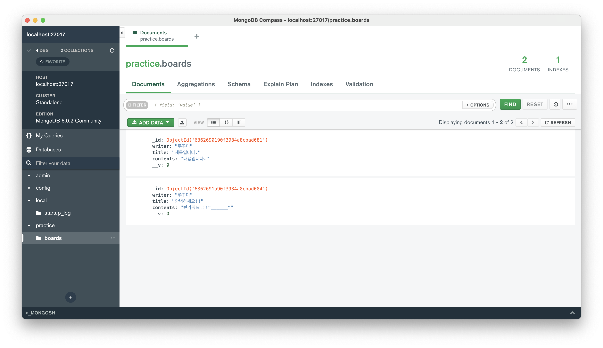

# 2022년 11월 TIL

## 2022.11.17

### Jest - testing code

꼭 TDD를 하지 않더라도 테스트 코드를 짜는 습관을 들이는 것이 좋다.  
jest를 사용하여 간단하게 유닛 테스트를 진행하는 방법 복기해봄.  
Next.js 공식 문서에도 [Testing 항목](https://nextjs.org/docs/testing#jest-and-react-testing-library)이 있다.

**0. Next.js 프로젝트에 jest 설치하기**

```
yarn add -D jest jest-environment-jsdom @testing-library/react @testing-library/jest-dom
```

```js
// jest.config.js
const nextJest = require("next/jest");

const createJestConfig = nextJest({
  // Provide the path to your Next.js app to load next.config.js and .env files in your test environment
  dir: "./",
});

// Add any custom config to be passed to Jest
/** @type {import('jest').Config} */
const customJestConfig = {
  // Add more setup options before each test is run
  // setupFilesAfterEnv: ['<rootDir>/jest.setup.js'],
  // if using TypeScript with a baseUrl set to the root directory then you need the below for alias' to work
  moduleDirectories: ["node_modules", "<rootDir>/"],
  testEnvironment: "jest-environment-jsdom",
};

// createJestConfig is exported this way to ensure that next/jest can load the Next.js config which is async
module.exports = createJestConfig(customJestConfig);
```

공식 문서가 시키는 대로 패키지 설치하고 jest.config.js 파일 생성 완료. eslint plugin에도 `jext/globals`를 추가해줬다.

**1. jest - 유닛 테스트 (단순 함수)**

```ts
export const add = (a: number, b: number) => {
  return a + b;
};
```

```ts
import { add } from "../../pages/34-01-jest";

it("더하기 잘 되는지 테스트 해보기", () => {
  const result = add(3, 5);
  expect(result).toBe(8);
});
```

**2. jest - 유닛 테스트 (화면)**

```ts
export default function JestUnitTestPage() {
  return (
    <>
      <div>철수는 13살 입니다.</div>
      철수의 취미 입력하기: <input type="text" />
      <button>철수랑 놀러가기</button>
    </>
  );
}
```

```ts
import { render, screen } from "@testing-library/react";
import JestUnitTestPage from "../../pages/34-02-jest-unit-test";
import "@testing-library/jest-dom";

it("내가 원하는대로 그려지는지 테스트하기", () => {
  render(<JestUnitTestPage />);

  const myText1 = screen.getByText("철수는 13살 입니다.");
  expect(myText1).toBeInTheDocument(); // render한 문서 안에 myText1이 있는지 확인한다.

  const myText2 = screen.getByText("철수의 취미 입력하기:");
  expect(myText2).toBeInTheDocument(); // render한 문서 안에 myText2이 있는지 확인한다.

  const myText3 = screen.getByText("철수랑 놀러가기");
  expect(myText3).toBeInTheDocument(); // render한 문서 안에 myText3이 있는지 확인한다.
});
```

화면의 구조가 복잡해지면 위와 같이 요소를 하나하나 다 작성해서 비교하는 것은 비효율적이다. 그래서 화면이 제대로 그려졌는지 테스트하기 위해서는 스냅샷 테스트를 주로 이용한다.

:::tip 의문  
그런데 사실 이런 테스트를 할 일이 얼마나 있을까..? 🤔 화면단은 테스트 코드보다 QA와 디자이너&기획자의 검수가 필요하지 않을까 그런 생각이 든다. 뭐 그래도 일단 할 줄은 알아야 하니까..  
:::

**3. jest - 스냅샷 테스트**

```ts
export default function JestUnitTestPage() {
  return (
    <>
      <div>철수는 14살 입니다.</div>
      철수의 취미 입력하기: <input type="text" />
      <button>철수랑 놀러가기</button>
    </>
  );
}
```

```ts
import { render } from "@testing-library/react";
import JestUnitTestPage from "../../pages/34-03-jest-unit-test-snapshot";

it("기존 사진이랑 바뀐게 없는지 비교해보자!! - 스냅샷 테스트", () => {
  const result = render(<JestUnitTestPage />);
  expect(result.container).toMatchSnapshot();
});
```

## 2022.11.09

지옥의 강의 촬영 주간이 돌아왔다. 게다가 깔끔한 퇴사를 위한 채용 프로세스 참여 + 인수인계 작업 때문에 눈코뜰 새 없이 바쁘다. 빙글빙글 정신없이 돌아가는 하루하루. 😵‍💫🫤😵‍💫😔😵‍💫🫠😵‍💫🤯😵‍💫 그래도 사내 스터디 덕분에 공부는 멈추지 않고 있다. 요즘에는 JS Deep dive를 빠르게 훑으며 JS 원론에 대한 이해를 기초부터 쌓아가는 중. 퇴사하면 스터디 참여를 못 하는게 제일 아쉽네.. 혼자라도 늘어지지 말고 꼭 올해 안에 완독해야지.  
[Deep dive 요약 정리 바로가기](../book-js/js-deepdive.html)

## 2022.11.02

### Mongodb 설치 & 실행

널리 사용되는 NoSQL DB인 MongoDB를 설치하고 실행해봤다.  
데이터베이스를 확인하기 위한 gui는 mongo-compass를 사용했고, ODM은 mongoose 사용.

- `mongodb-community` : 무료버전
- `mongodb-enterprise` : 유료버전

- **설치 방법**  
  MacOS는 Homebrew를 사용해서 MongoDB를 간단하게 설치할 수 있다. [공식 문서의 설치 가이드](https://www.mongodb.com/docs/manual/tutorial/install-mongodb-on-os-x/) 참고.

  ```
  brew tap mongodb/brew
  brew install mongodb-community
  ```

  설치를 완료한 뒤 `brew list`를 입력하면 brew를 이용해 설치한 패키지 목록에서 **mongodb-community, mongodb-database-tools, mongosh** 를 찾아볼 수 있다. 이 중 mongosh는 MongoDB에서 사용할 수 있는 쉘 같은 것

- **DB 실행**  
   mongoDB 실행 명령어

  ```
  brew services start mongodb-community
  ```

  MongoDB는 기본적으로 27017 포트에서 실행된다. 실행 후 [mongo-compass](https://www.mongodb.com/try/download/compass)를 이용해 localhost:27017에 접속하면 DB를 확인할 수 있다.


### Docker-compoase를 이용한 server & mongoDB 동시 실행

DB와 Backend를 로컬에서 바로 실행해도 되지만, 관리하기 편하도록 docker-compose를 이용해 묶어 실행해봤다. backend service를 담당하는 Dockerfile 하나, DB를 담당하는 Dockerfile 하나 만들어서 docker-compose를 이용해 연결해서 실행.

```yaml
version: "3.3"

services:
  my_backend:
    build:
      context: .
      dockerfile: Dockerfile
    ports:
      - 4000:4000

  my_database:
    build:
      context: .
      dockerfile: Dockerfile.mongo
    ports:
      - 27017:27017
```

docker-compose가 있는 위치에서 `docker-compose build`를 이용해 빌드하고, `docker-compose up`을 이용해 빌드한 Docker image를 실행하면 된다.

그런데 지금 소스코드에서 Dockerfile.mongo가 해주는 역할은 사실 Docker hub에서 mongodb image를 불러와 실행시키는 것 밖에 없다. 즉, 다음과 같이 image를 바로 불러오는 방식으로 변경해도 문제가 없다.

```yaml
version: "3.3"

services:
  my_backend:
    build:
      context: .
      dockerfile: Dockerfile
    ports:
      - 4000:4000

  my_database:
    image: mongo:latest
    ports:
      - 27017:27017
```

### Mongoose

[Mongoose](https://mongoosejs.com/)는 Node.js와 MongoDB를 위한 ODM이다. ODM이란 Object Data Mapping이라는 의미로, RDB에 ORM이 있다면 Document 기반 NoSQL에는 ODM이 있다고 생각하면 간단..

Board라는 이름으로 기본이 되는 Schema와 Model을 만들었다. 그리고 기존에 만들어두었던 express api들과 연결해봤음..!

```js
// board.model.js
import mongoose from "mongoose";

const boardSchema = new mongoose.Schema({
  writer: String,
  title: String,
  contents: String,
});

export const Board = mongoose.model("Board", boardSchema);
```

```js
// index.js

//...

mongoose.connect("mongodb://my_database:27017/practice");

app.get("/boards", async (req, res) => {
  const boards = await Board.find();
  res.send(boards);
});

app.post("/boards", async (req, res) => {
  const board = new Board({
    writer: req.body.writer,
    title: req.body.title,
    contents: req.body.contents,
  });
  await board.save();
  res.send("게시물 등록에 성공하였습니다!!");
});
```

mongoose에서 모델의 스키마를 정의할 때 사용할 수 있는 타입, 사용할 수 있는 메소드 등은 [공식 문서](https://mongoosejs.com/docs/guide.html)를 통해 확인할 수 있다.

```js
// 연습하며 사용해 본 mongoose 메소드들
find();
findOne();
save();
updateOne();
deleteOne();
```

  


Docker-compose를 이용해 서버와 db 컨테이너 동시 실행 후 API 요청 성공 😗😋

## 2022.11.01

### Docker

컨테이너 기반 오픈소스 가상화 플랫폼.  
컨테이너란 Host OS 상에서 리소스를 논리적으로 구분하여 마치 별도의 서버인 것처럼 사용할 수 있게 하는 기술. 이 때, 각각의 리소스를 물리적으로 구분하는 것이 아니라 논리적으로 구분한다는 점이 중요하다. 그러한 특징 때문에 기존의 가상화 도구들에 비해 가벼운 것.

docker는 `Dockerfile`을 이용해 실행할 수 있다.

1. **Dockerfile 예시**

```docker
FROM node:16

WORKDIR /my_backend/
COPY ./package.json /my_backend/
COPY ./yarn.lock /my_backend/
RUN yarn install

COPY . /my_backend/
CMD node index.js
```

2. **docker 명령어**

| 명령어                       | 내용                         |
| ---------------------------- | ---------------------------- |
| `docker build .`             | 도커 이미지 빌드             |
| `docker images`              | 빌드한 도커 이미지 목록 확인 |
| `docker run [IMAGE_ID]`      | 도커 이미지 실행             |
| `docker ps`                  | 실행중인 도커 프로세스 확인  |
| `docker stop [CONTAINER_ID]` | 특정 컨테이너 실행 중단      |

3. **실행중인 컨테이너 내부로 접근**  
   이러한 방법을 이용해 컨테이너 내부로 이동해 `ls` 명령어를 입력하면 소스코드가 복사되어 있는 것을 확인할 수 있다.

```
docker exec -it [CONTAINER_ID] /bin/bash
```

4. **포트 포워딩**  
   도커 컨테이너 내부에서 실행되고 있는 포트와 내 컴퓨터의 포트를 연결해줘야 외부에서도 해당 포트에 접근할 수 있다. 이러한 작업을 포트 포워딩이라고 한다.

```
docker run -p [LOCAL_PORT]:[CONTAINER_PORT] [IMAGE_ID]
docker run -p 1000:4000 b4e6b94936a9
```

5. **도커 실행 명령어 옵션**

| OPTIONS | 설명                                        |
| ------- | ------------------------------------------- |
| `-d`    | 백그라운드 모드 실행 (detached mode)        |
| `-p`    | 포트 포워딩 = 호스트와 컨테이너의 포트 연결 |
| `-v`    | 호스트와 컨테이너의 디렉토리 연결(마운트)   |
| `-e`    | 컨테이너 내에서 사용할 환경변수 설정        |
| `-name` | 컨테이너 이름 설정                          |
| `-rm`   | 프로세스 종료시 컨테이너 자동 제거          |
| `-it`   | 터미널 입력 옵션                            |
| `-link` | 컨테이너 연결                               |

::: tip Ref  
[https://docs.docker.com/engine/reference/commandline/run/](https://docs.docker.com/engine/reference/commandline/run/)  
[https://myjamong.tistory.com/297](https://myjamong.tistory.com/297)  
[https://pearlluck.tistory.com/144](https://pearlluck.tistory.com/144)
:::
